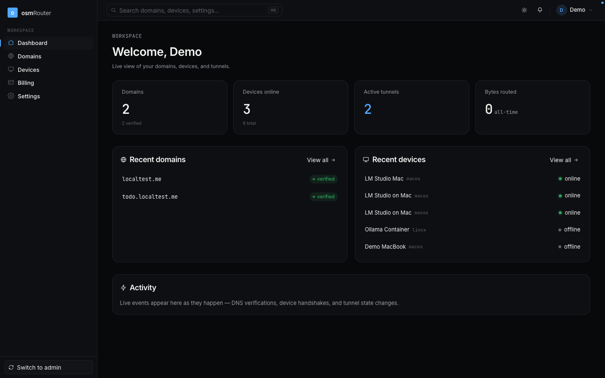
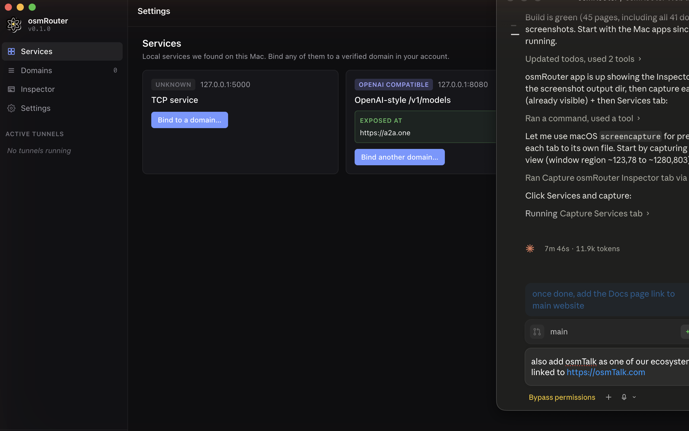
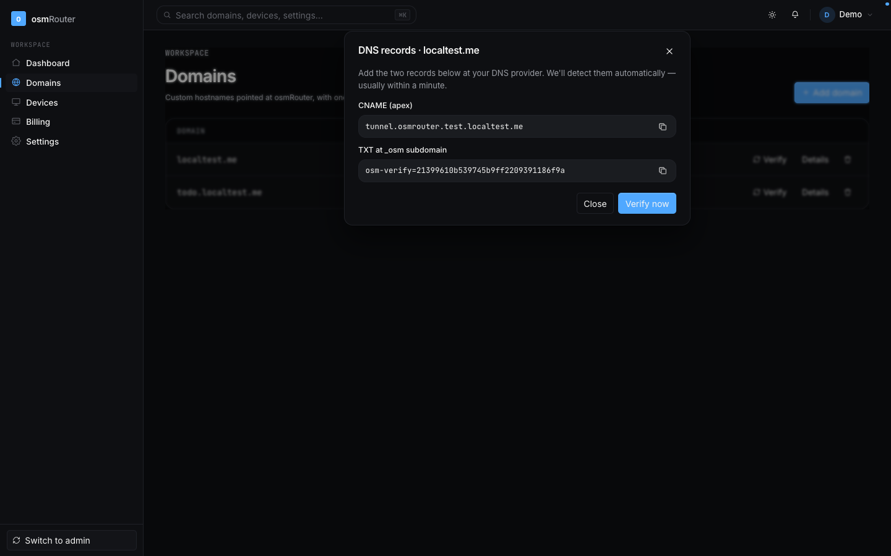
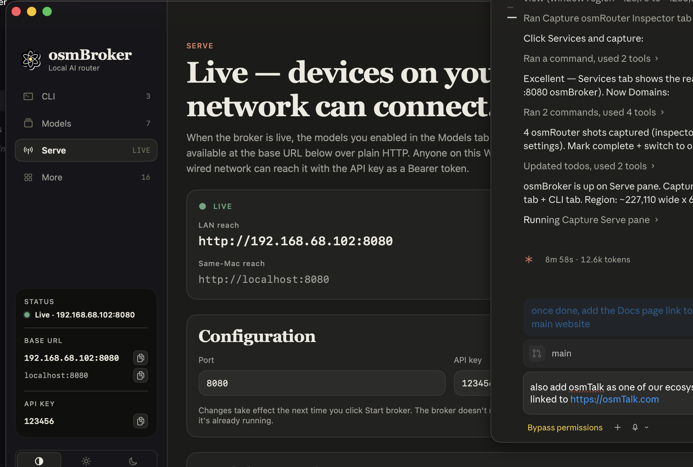
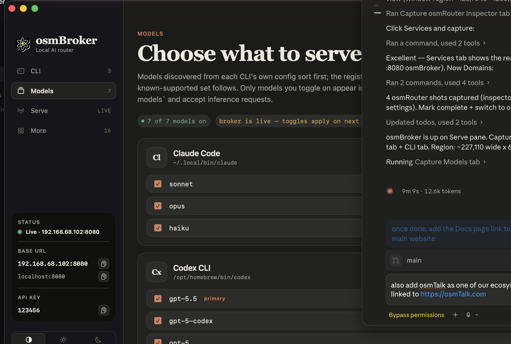

<div align="center">


# osmRouter

**Stop renting the internet. Start owning it.**

Sovereign, BYO-domain reverse tunnels — for self-hosted services and self-hosted AI inference. No third party in the data path.

<p>
  <a href="LAUNCH.md"></a>
  <a href="DEPLOY.md"></a>
  <a href="mac-app/COMPILE.md"></a>
  <a href="https://osmapi.com"></a>
</p>

</div>

---

osmRouter binds a public hostname to a process running on hardware **you** control — through a persistent reverse tunnel that survives reboots, IP changes, and CGNAT.

The cloud was supposed to democratize compute. Somewhere along the way, it became a landlord. **osmRouter is for everyone who wants to be the origin of their own internet.**

---

## How it works

```
visitor ──TLS 1.3──▶ Caddy edge ──HTTP──▶ osm-proxy ──pinned-TLS──▶ osm-agent ──HTTP──▶ your process
                     (operator)            (operator)               (your Mac)         (localhost)
```

Two unusual properties make this different from every other reverse-tunnel SaaS:

1. **Pinned TLS** — the trust anchor between the proxy and your Mac is the operator's CA, embedded at compile time into both binaries. System trust stores are ignored on this hop. There is no "did the user install the CA correctly?" question.
2. **Role-inverted HTTP/2** — your Mac dials the proxy outbound (firewall-friendly), but inside the resulting TCP socket, your Mac is the HTTP/2 *server*. The proxy is the *client*. The proxy forwards visitor requests into the tunnel and your Mac responds. This is how your laptop "is" the public origin without ever opening a port.

The cloud operator (whoever runs the proxy + control plane — you, if you're self-hosting) **cannot read request bodies**, cannot replay them, cannot rate-limit per-app. The proxy sees TLS handshakes + encrypted application bytes. Your Mac decrypts on arrival.

📐 Full wire-protocol spec: [`Yellow Paper/`](Yellow%20Paper/osmRouter-Yellow-Paper.md). Architecture in 60 seconds: [`LAUNCH.md`](LAUNCH.md#2-architecture-in-60-seconds).

---

## What you get

<table>
<tr>
<td width="50%" valign="top">

### 🌐 Web Dashboard
Add a domain, verify ownership via DNS, bind subdomains to local ports. See live tunnel traffic, manage devices, rotate keys.



</td>
<td width="50%" valign="top">

### 🖥️ Mac App
The osmRouter Mac app discovers every listener on your machine (`lsof`-based) and lets you bind any of them to a verified domain with a single click.



</td>
</tr>
<tr>
<td width="50%" valign="top">

### 📡 BYO domain, BYO TLS
Caddy on the edge mints Let's Encrypt certs on-demand for any verified customer domain. No per-customer config; the control plane gates issuance via an `ask` hook.



</td>
<td width="50%" valign="top">

### 🤖 osmBroker — AI CLIs as one OpenAI API
Aggregate Claude Code, Codex, Gemini, Ollama, LM Studio, and 11 other terminal agents into one OpenAI-compatible HTTP endpoint. Plug into AnythingLLM, Open WebUI, LiteLLM — anything.



</td>
</tr>
</table>

---

## Quick start (operator side)

You need: a Linux server with Docker, a domain you own, and ~10 minutes.

```bash
# 1. Clone the repo onto your server
git clone https://github.com/junainfinity/osmRouter.git /opt/osmRouter
cd /opt/osmRouter

# 2. Mint the operator CA (10-year root + 90-day proxy leaf)
SAN_LIST="DNS:tunnel.your-domain.com" ./scripts/init-ca.sh

# 3. Fill .env (every «CHANGE» token + SMTP creds + your edge IP)
cp .env.example .env
./scripts/generate-secrets.sh >> .env
$EDITOR .env

# 4. Bring up the Docker stack
docker compose -f deploy/docker-compose.yml --env-file .env up -d --build

# 5. Front it with TLS — copy + edit, then reload
cp deploy/Caddyfile.example /etc/caddy/Caddyfile
# (edit `osmrouter.com` references to your brand domain)
systemctl reload caddy
```

After this you'll have:

- Dashboard: `https://your-domain.com`
- API: `https://api.your-domain.com`
- Docs: `https://docs.your-domain.com`
- Tunnel listener (for Mac sidecars): `:8443` (proxy terminates its own TLS — don't put Caddy in front of this port)

The full runbook (DNS, SMTP, CA rotation, backups, troubleshooting) is in [`DEPLOY.md`](DEPLOY.md).

---

## Quick start (Mac-app side)

End users don't run `osm-agent` directly — they install your branded Mac app. You build it from `mac-app/` after the operator CA has been minted:

```bash
# Copy the operator CA root into the embed slot
cp ca/root.pem mac-app/apps/sidecar/internal/embedded_ca/root.pem

# One-shot build (CA gate → tests → cross-compile → selftest → signed .dmg)
cd mac-app && ./scripts/compile-mac.sh
```

A build that forgot to swap the placeholder CA fails closed at three layers (build-script grep, Go `Validate()`, unit test). It cannot ship a Mac app that trusts the placeholder.

Full walkthrough: [`mac-app/COMPILE.md`](mac-app/COMPILE.md).

---

## Repository layout

```
osmRouter/
├── LAUNCH.md          # Read this first — concepts, architecture, repo tour
├── DEPLOY.md          # Operator runbook — cloud-side deploy
├── .env.example       # Every operator env var, with placeholders
│
├── server/            # Go control plane (Echo + GORM + Redis + WebSockets)
├── web/               # Next.js 16 dashboard (App Router + Tailwind v4)
├── docs/              # Fumadocs docs site (served at docs.<your-domain>)
├── proxy-node/        # Go data plane proxy edge
├── mac-app/           # Mac client source (electron-forge monorepo)
├── deploy/            # Dockerfiles + docker-compose.yml + Caddyfile.example
├── scripts/           # init-ca.sh, generate-secrets.sh
├── Whitepaper/        # Business paper (Markdown + HTML)
└── Yellow Paper/      # Formal technical specification (Markdown + HTML w/ MathJax)
```

---

## Use-case: an OpenAI-compatible LLM endpoint on your own Mac

Pair osmRouter with **osmBroker** (a sibling project — a separate Mac app that fronts 16 terminal AI agents) and you've got:

- A public HTTPS URL on a domain you own
- Running inference on hardware you own
- Charged against *your* underlying API keys (your Anthropic plan, your ChatGPT account, your Ollama process)
- Speaking the OpenAI Chat Completions API so every client (AnythingLLM, Open WebUI, LiteLLM, OpenAI SDKs) plugs in unchanged



The brokered model list above shows 7 models from 2 CLIs (Claude Code + Codex), all served at one local port via one shared API key, exposed to the world via one osmRouter tunnel.

---

## Status & honesty list

What works today (v1):

- ✅ All sign-up / login / domain-verification / device-binding flows
- ✅ Pinned-TLS + role-inverted HTTP/2 tunnel — proven end-to-end with SSE streaming
- ✅ Long inference (>30 s) survives — no wall-clock timeout, only visitor-context cancellation
- ✅ Mac app with signed `.dmg` (universal binary, macOS 14+)
- ✅ Caddy on-demand TLS for customer BYO domains
- ✅ Email OTP delivery via any plain-SMTP relay (Gmail/Postmark/SES)

Deferred to v2.1 (be honest with yourself before you ship to paying customers):

- ⏳ Cloudflare-for-SaaS auto-onboarding (so customers don't add their own A records)
- ⏳ Stripe webhook → invoicing (handlers exist, webhook is stubbed)
- ⏳ WebAuthn admin MFA (admin still uses email OTP)
- ⏳ Per-node proxy leaf certs (today: one shared leaf)
- ⏳ Automatic CA leaf rotation (today: manual cron-friendly script)
- ⏳ WebSocket push of binding changes to the Mac app (today: app restart reconciles)

See [`LAUNCH.md` §10](LAUNCH.md#10-whats-open--whats-deferred-to-v21) for the locations of the stubs.

---

## License

TBD. If you're forking this for commercial use, please reach out at [hello@osmapi.com](mailto:hello@osmapi.com).

---

## Thanks

osmRouter was forged by the [**osmAPI.com**](https://osmapi.com) team — a collective of engineers obsessed with one concept: **digital sovereignty**.

We believe that in the age of AI, compute is the new currency. By creating osmRouter, we're returning that currency to the people. This isn't just a tool; it's our love letter to an open, decentralized, sovereign internet.

If this project is useful to you, build something with it that you couldn't have built on a cloud landlord.

<sub>— Architects of [osmAPI.com](https://osmapi.com) · [osmAgent](https://www.osmapi.com/osmagent) · [osmTalk](https://osmtalk.com) · [OHM](https://ohm.doctor) · osmRouter</sub>
